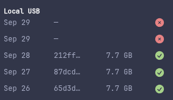
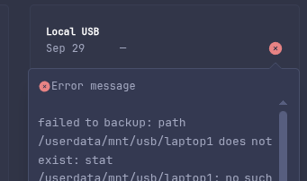

# Backrest Widget

Backrest is a web-accessible backup solution built on top of restic. Backrest provides a WebUI which wraps the restic CLI and makes it easy to create repos, browse snapshots, and restore files. 

This widget queries its API and shows:
- Date of the backup  
- Snapshot ID  
- Size processed  
- Status (✅ success / ❌ error)  
- Error details (via tooltip)  

> [!NOTE]  
>  To use this widget Backrest authentication must be disabled

 

---

## Environment Variables

| Variable | Description |
|----------|-------------|
| `BACKREST_URL` | Base URL of your Backrest server (e.g. `http://backrest.local:9898`). Authentication must be disabled for the API to be accessible. |
| `BACKREST_PLAN_LOCAL` | The plan ID for the backup plan you want to display. This comes from Backrest’s configured snapshot plans. Use a different plan ID if you want to create another widget for remote/cloud backups. |

---

## Options

| Option | Default | Description |
|--------|---------|-------------|
| `LIMIT` | `5` | Maximum number of snapshot operations to show. |
| `PRECISION` | `1` | Decimal precision for backup size (in GB). |
| `UNIT` | `GB` | Unit to display for size (e.g. `GB`, `MB`, `TB`). |
| `BACKREST_PLAN_TITLE` | `Backups` | Title displayed above the snapshot list (e.g. `Local USB`, `Amazon S3`). |

---

## Behaviour

- **Success rows** show snapshot date, short snapshot ID, size, and a ✅ success icon.  
  Tooltip: “Completed successfully”.  
- **Error rows** show snapshot date, ID (if any), and a ❌ error icon.  
  Tooltip: “Error message” + the raw Backrest error message (`displayMessage`).  
- Only true backup operations are included (ignores hooks).  
- Snapshots with `STATUS_SUCCESS` and `>0 bytes` are treated as valid backups.  
- Snapshots with `STATUS_ERROR` and type `operationBackup` (not `operationRunHook`) are treated as failed backups.  

---

## Code

```yaml
- type: custom-api
  title: Config Backups
  cache: 1m
  subrequests:
    plan:
      url: ${BACKREST_URL}/v1.Backrest/GetOperations
      method: POST
      headers:
        Content-Type: application/json
      body-type: json
      body:
        selector:
          planId: ${BACKREST_PLAN_LOCAL}
  options:
    LIMIT: 5
    PRECISION: 1
    UNIT: GB
    BACKREST_PLAN_TITLE: Local USB
  template: |
    {{ $limit := .Options.IntOr "LIMIT" 5 }}
    {{ $precision := .Options.IntOr "PRECISION" 1 }}
    {{ $unit := .Options.StringOr "UNIT" "GB" }}

    <div class="size-h6 color-highlight margin-bottom-8" style="font-weight: 700; margin-top: 6px;">
      {{ .Options.StringOr "BACKREST_PLAN_TITLE" "Backups" }}
    </div>
    <ul class="dynamic-columns list-gap-8 margin-bottom-20">
      {{ $count := 0 }}
      {{ range $op := (sortByInt "id" "desc" ((.Subrequest "plan").JSON.Array "operations")) }}
        {{ if lt $count $limit }}
          {{ $status := $op.String "status" }}
          {{ $snap := $op.String "snapshotId" }}
          {{ $bytes := $op.Float "operationIndexSnapshot.snapshot.summary.totalBytesProcessed" }}
          {{ $isBackup := $op.Exists "operationBackup" }}
          {{ $isHook := $op.Exists "operationRunHook" }}
          {{ $ms := $op.Int "unixTimeEndMs" }}
          {{ $sec := div $ms 1000 }}
          {{ $secStr := printf "%d" $sec }}
          {{ $ended := (parseTime "unix" $secStr) | formatTime "Jan 02" }}
          {{ $msg := $op.String "displayMessage" }}

          {{ if or (and (eq $status "STATUS_SUCCESS") (gt $bytes 0.0)) (and (eq $status "STATUS_ERROR") $isBackup (not $isHook)) }}
            <div class="flex items-center gap-12">
              <div class="size-h5" style="min-width: 70px;">
                {{ $ended }}
              </div>
              <div class="size-h5 text-truncate block grow">
                {{ if $snap }}{{ replaceMatches "^(.{8}).*" "$1" $snap }}{{ else }}—{{ end }}
              </div>
              <div class="size-h5" style="min-width: 90px; text-align: center;">
                {{ if and (eq $status "STATUS_SUCCESS") (gt $bytes 0.0) }}
                  {{ printf "%.*f %s" $precision (div $bytes 1073741824) $unit }}
                {{ end }}
              </div>
              <div class="monitor-site-status-icon-compact"
                   data-popover-type="html" data-popover-position="above" data-popover-show-delay="300">
                {{ if eq $status "STATUS_SUCCESS" }}
                  <svg fill="var(--color-positive)" xmlns="http://www.w3.org/2000/svg" viewBox="0 0 20 20">
                    <path fill-rule="evenodd" d="M10 18a8 8 0 1 0 0-16 8 8 0 0 0 0 16Zm3.857-9.809a.75.75 0 0 0-1.214-.882l-3.483 4.79-1.88-1.88a.75.75 0 1 0-1.06 1.061l2.5 2.5a.75.75 0 0 0 1.137-.089l4-5.5Z" clip-rule="evenodd"/>
                  </svg>
                  <div data-popover-html>
                    <div class="size-h5">Completed successfully</div>
                  </div>
                {{ else if eq $status "STATUS_ERROR" }}
                  <svg fill="var(--color-negative)" xmlns="http://www.w3.org/2000/svg" viewBox="0 0 20 20">
                    <path fill-rule="evenodd" d="M10 18a8 8 0 1 0 0-16 8 8 0 0 0 0 16ZM7.646 7.646a.5.5 0 0 1 .708 0L10 9.293l1.646-1.647a.5.5 0 0 1 .708.708L10.707 10l1.647 1.646a.5.5 0 0 1-.708.708L10 10.707l-1.646 1.647a.5.5 0 0 1-.708-.708L9.293 10 7.646 8.354a.5.5 0 0 1 0-.708Z" clip-rule="evenodd"/>
                  </svg>
                  <div data-popover-html>
                    <div class="flex items-center gap-8">
                      <svg style="width: 1.5rem; height: 1.5rem;" fill="var(--color-negative)" xmlns="http://www.w3.org/2000/svg" viewBox="0 0 20 20">
                        <path fill-rule="evenodd" d="M10 18a8 8 0 1 0 0-16 8 8 0 0 0 0 16ZM7.646 7.646a.5.5 0 0 1 .708 0L10 9.293l1.646-1.647a.5.5 0 0 1 .708.708L10.707 10l1.647 1.646a.5.5 0 0 1-.708.708L10 10.707l-1.646 1.647a.5.5 0 0 1-.708-.708L9.293 10 7.646 8.354a.5.5 0 0 1 0-.708Z" clip-rule="evenodd"/>
                      </svg>
                      <div class="size-h5"> Error message</div>
                    </div>
                    <div class="text-compact" style="max-width: 28rem; max-height: 14rem; overflow-y: auto; white-space: pre-wrap; margin: 0;">
    {{ if $msg }}{{ $msg }}{{ else }}No message{{ end }}
                    </div>
                  </div>
                {{ end }}
              </div>
            </div>
            {{ $count = add $count 1 }}
          {{ end }}
        {{ end }}
      {{ end }}
    </ul>
