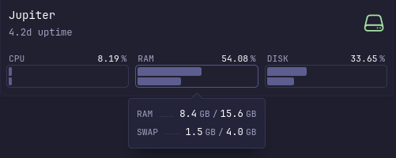
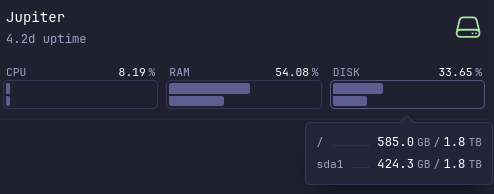

## Introduction

This widget mimics the style of the builtin
[Server Stats](https://github.com/glanceapp/glance/blob/main/docs/configuration.md#server-stats)
widget, but it pulls the data from a [Beszel](https://github.com/henrygd/beszel)
instance instead. The collected data is about the same, but it means needing to
run one less container if you already have beszel running to monitor your
servers.

If you encounter any issues, please open an issue, tag me, and I’ll investigate further.

Customisation can be applied using the `options:` field. See [Options](#options) for more details.

## Preview






## Environment Variables

> [!IMPORTANT]
>
> For URLs, you **MUST** include `http://` or `https://`.
> Do **NOT** include a trailing `/` at the end of URLs.

* `BESZEL_URL` - The URL to your Beszel Hub instance, e.g., `http://<ip_address>:<port>` or `https://<domain>`
* `BESZEL_TOKEN` - Your personal Beszel API Token.

To setup Beszel API grabbing your token is required, to get it use a command
below. Remember to replace `USERNAME`, `PASSWORD` and `IP:PORT`.

```sh
curl -X POST "http://IP:PORT/api/collections/users/auth-with-password" \
  -H "Content-Type: application/json" \
  -d '{"identity":"USERNAME","password":"PASSWORD"}'
```

## Secrets

Since `v0.8.0`, you can use Docker secrets instead of environment variables. See [v0.8.0 Release Notes](https://github.com/glanceapp/glance/releases/tag/v0.8.0#g-rh-5) for more information.
If you do, replace `${YOUR_API_KEY}` with `${secret:your-api-key-secret}`.

## Options

Since `v0.8.0`, you can use the `options:` field to customise the widget.
See [v0.8.0 Release Notes](https://github.com/glanceapp/glance/releases/tag/v0.8.0#g-rh-15) for more information.

Default options are:
```yaml
options:
  # Required options
  base-url: ${BESZEL_URL}  # Your environment-variables for the URL
  api-key: ${BESZEL_TOKEN} # Your environment-variables for the API token. Can be a secret as well `${secret:beszel-token}`
```

## Widget YAML

```yaml
- type: custom-api
  title: Server Stats
  cache: 5m
  options:
    base-url: ${BESZEL_URL}
    api-key: ${BESZEL_TOKEN}
  template: |
    {{/* Required config options */}}
    {{ $baseURL := .Options.StringOr "base-url" "" }}
    {{ $apiKey := .Options.StringOr "api-key" "" }}

    {{/* Error message template */}}
    {{ define "errorMsg" }}
      <div class="widget-error-header">
        <div class="color-negative size-h3">ERROR</div>
        <svg class="widget-error-icon" xmlns="http://www.w3.org/2000/svg" fill="none" viewBox="0 0 24 24" stroke-width="1.5">
          <path stroke-linecap="round" stroke-linejoin="round" d="M12 9v3.75m-9.303 3.376c-.866 1.5.217 3.374 1.948 3.374h14.71c1.73 0 2.813-1.874 1.948-3.374L13.949 3.378c-.866-1.5-3.032-1.5-3.898 0L2.697 16.126ZM12 15.75h.007v.008H12v-.008Z"></path>
        </svg>
      </div>
      <p class="break-all">{{ . }}</p>
    {{ end }}

    {{ define "formatGigabytes" }}
      {{ $value := . }}
      {{ $label := "GB" }}
      {{- if lt $value 1.0 }}
        {{ $value = mul $value 1000.0 }}
        {{ $label = "MB" }}
      {{- else if lt $value 1000.0 }}
      {{ else }}
        {{ $value = div $value 1000.0 }}
        {{ $label = "TB" }}
      {{ end }}
      {{ printf "%.1f" $value }} <span class="color-base size-h5">{{ $label }}</span>
    {{ end }}

    {{/* Check required fields */}}
    {{ if or (eq $baseURL "") (eq $apiKey "") }}
      {{ template "errorMsg" "Some required options are not set." }}
    {{ else }}

      {{ $token := concat "Bearer " $apiKey }}

      {{ $systemsResponse := newRequest (print $baseURL "/api/collections/systems/records")
          | withHeader "Authorization" $token
          | getResponse }}
      {{ $systems := $systemsResponse.JSON.Array "items" }}


      {{ range $n, $system := $systems }}
        {{ $status := $system.String "status" }}

        {{ $systemStatsRequest := newRequest (print $baseURL "/api/collections/system_stats/records")
            | withHeader "Authorization" $token
            | withParameter "sort" "-created"
            | withParameter "page" "1"
            | withParameter "perPage" "1"
            | withParameter "filter" (print "type='1m'&&system='" ($system.String "id") "'")
            | getResponse }}
        {{ $systemStats := index ($systemStatsRequest.JSON.Array "items") 0 }}

        {{ $hostname := $system.String "name" }}
        {{ $uptimeSec := $system.Float "info.u" }}

        {{ $systemTemp := $system.Float "info.dt"}}

        {{ $cpuLoad := $system.Float "info.cpu" }}
        {{ $cpuLoad1m := $system.Float "info.l1" }}
        {{ $cpuLoad15m := $system.Float "info.l15" }}

        {{ $memoryUsedPercent := $system.Float "info.mp" }}
        {{ $memoryTotalGb := $systemStats.Float "stats.m" }}
        {{ $memoryUsedGb := $systemStats.Float "stats.mu" }}

        {{ $swapTotalGb := $systemStats.Float "stats.s" }}
        {{ $swapUsedGb := $systemStats.Float "stats.su" }}
        {{ $swapUsedPercent := mul (div $swapUsedGb $swapTotalGb) 100.0 }}

        {{ $rootUsedPercent := $system.Float "info.dp" }}
        {{ $rootTotalGb := $systemStats.Float "stats.d" }}
        {{ $rootUsedGb := $systemStats.Float "stats.du" }}

        <div class="server">
          <div class="server-info">
            <div class="server-details">
              <div class="server-name color-highlight size-h3">{{ $hostname }}</div>
              <div>
                {{ if eq $status "up" }}
                  <span>{{ printf "%.1f" (mul $uptimeSec 0.000011574) }}d</span> uptime
                {{ else }}
                  unreachable
                {{ end }}
              </div>
            </div>
            <div class="shrink-0"{{ if eq $status "up" }} data-popover-type="html" data-popover-margin="0.2rem" data-popover-max-width="400px"{{ end }}>
              {{- if eq $status "up" }}
              <div data-popover-html>
                <div class="flex">
                  <div class="size-h5 text-compact">Kernel</div>
                  <div class="value-separator"></div>
                  <div class="color-highlight">{{ $system.String "info.k" }}</div>
                </div>
                <div class="flex">
                  <div class="size-h5 text-compact">CPU</div>
                  <div class="value-separator"></div>
                  <div class="color-highlight">{{ $system.String "info.m" }}</div>
                </div>
              </div>
              {{- end }}
              <svg class="server-icon" stroke="var(--color-{{ if eq $status "up" }}positive{{ else }}negative{{ end }})" xmlns="http://www.w3.org/2000/svg" fill="none" viewBox="0 0 24 24" stroke-width="1.5">
                <path stroke-linecap="round" stroke-linejoin="round" d="M21.75 17.25v-.228a4.5 4.5 0 0 0-.12-1.03l-2.268-9.64a3.375 3.375 0 0 0-3.285-2.602H7.923a3.375 3.375 0 0 0-3.285 2.602l-2.268 9.64a4.5 4.5 0 0 0-.12 1.03v.228m19.5 0a3 3 0 0 1-3 3H5.25a3 3 0 0 1-3-3m19.5 0a3 3 0 0 0-3-3H5.25a3 3 0 0 0-3 3m16.5 0h.008v.008h-.008v-.008Zm-3 0h.008v.008h-.008v-.008Z" />
              </svg>
            </div>
          </div>

          <div class="server-stats">
            <div class="flex-1">
              <div class="flex items-end size-h5">
                <div>CPU</div>
                {{- if ge $systemTemp 80.0 }}
                <svg class="server-spicy-cpu-icon" fill="var(--color-negative)" xmlns="http://www.w3.org/2000/svg" viewBox="0 0 16 16" >
                  <path fill-rule="evenodd" d="M8.074.945A4.993 4.993 0 0 0 6 5v.032c.004.6.114 1.176.311 1.709.16.428-.204.91-.61.7a5.023 5.023 0 0 1-1.868-1.677c-.202-.304-.648-.363-.848-.058a6 6 0 1 0 8.017-1.901l-.004-.007a4.98 4.98 0 0 1-2.18-2.574c-.116-.31-.477-.472-.744-.28Zm.78 6.178a3.001 3.001 0 1 1-3.473 4.341c-.205-.365.215-.694.62-.59a4.008 4.008 0 0 0 1.873.03c.288-.065.413-.386.321-.666A3.997 3.997 0 0 1 8 8.999c0-.585.126-1.14.351-1.641a.42.42 0 0 1 .503-.235Z" clip-rule="evenodd" />
                </svg>
                {{- end }}
                <div class="color-highlight margin-left-auto text-very-compact">{{ $cpuLoad }} <span class="color-base">%</span></div>
              </div>
              <div data-popover-type="html">
                <div data-popover-html>
                  <div class="flex">
                    <div class="size-h5">1M AVG</div>
                    <div class="value-separator"></div>
                    <div class="color-highlight text-very-compact">{{ printf "%.1f" $cpuLoad1m }} <span class="color-base size-h5">%</span></div>
                  </div>
                  <div class="flex margin-top-3">
                    <div class="size-h5">15M AVG</div>
                    <div class="value-separator"></div>
                    <div class="color-highlight text-very-compact">{{ printf "%.1f" $cpuLoad15m }} <span class="color-base size-h5">%</span></div>
                  </div>
                  <div class="flex margin-top-3">
                    <div class="size-h5">TEMP C</div>
                    <div class="value-separator"></div>
                    <div class="color-highlight text-very-compact">{{ printf "%.1f" $systemTemp }} <span class="color-base size-h5">°</span></div>
                  </div>
                </div>

                <div class="progress-bar progress-bar-combined">
                  <div class="progress-value{{ if ge $cpuLoad1m 85.0 }} progress-value-notice{{ end }}" style="--percent: {{ $cpuLoad1m }}"></div>
                  <div class="progress-value{{ if ge $cpuLoad15m 85.0 }} progress-value-notice{{ end }}" style="--percent: {{ $cpuLoad15m }}"></div>
                </div>
              </div>
            </div>

            <div class="flex-1">
              <div class="flex justify-between items-end size-h5">
                <div>RAM</div>
                <div class="color-highlight text-very-compact">{{ $memoryUsedPercent }} <span class="color-base">%</span></div>
              </div>
              <div data-popover-type="html">
                <div data-popover-html>
                  <div class="flex">
                    <div class="size-h5">RAM</div>
                    <div class="value-separator"></div>
                    <div class="color-highlight text-very-compact">
                      {{ template "formatGigabytes" $memoryUsedGb }} <span class="color-base size-h5">/</span> {{ template "formatGigabytes" $memoryTotalGb }}
                    </div>
                  </div> 
                  {{- if gt $swapTotalGb 0.0 }}
                  <div class="flex margin-top-3">
                    <div class="size-h5">SWAP</div>
                    <div class="value-separator"></div>
                    <div class="color-highlight text-very-compact">
                      {{ template "formatGigabytes" $swapUsedGb }} <span class="color-base size-h5">/</span> {{ template "formatGigabytes" $swapTotalGb }}
                    </div>
                  </div>
                  {{- end }}
                </div>
                <div class="progress-bar progress-bar-combined">
                  <div class="progress-value{{ if ge $memoryUsedPercent 85.0 }} progress-value-notice{{ end }}" style="--percent: {{ $memoryUsedPercent }}"></div>
                  {{- if gt $swapTotalGb 0.0 }}
                  <div class="progress-value{{ if ge $swapUsedPercent 85.0 }} progress-value-notice{{ end }}" style="--percent: {{ $swapUsedPercent }}"></div>
                  {{- end }}
                </div>
              </div>
            </div>

            <div class="flex-1">
              <div class="flex justify-between items-end size-h5">
                <div>DISK</div>
                <div class="color-highlight text-very-compact">{{ $rootUsedPercent }} <span class="color-base">%</span></div>
              </div>
              <div data-popover-type="html">
                <div data-popover-html>
                  <ul class="list list-gap-2">
                    <li class="flex">
                      <div class="size-h5">/</div>
                      <div class="value-separator"></div>
                      <div class="color-highlight text-very-compact">
                        {{ template "formatGigabytes" $rootUsedGb }} <span class="color-base size-h5">/</span> {{ template "formatGigabytes" $rootTotalGb }}
                      </div>
                    </li>
                    {{ range $key, $efs := ($systemStats.Get "stats.efs").Map }}
                      <li class="flex">
                        <div class="size-h5">{{ $key }}</div>
                        <div class="value-separator"></div>
                        <div class="color-highlight text-very-compact">
                          {{ template "formatGigabytes" (($efs.Get "du").Float) }} <span class="color-base size-h5">/</span> {{ template "formatGigabytes" (($efs.Get "d").Float) }}
                        </div>
                      </li>
                    {{ end }}
                  </ul>
                </div>
                <div class="progress-bar progress-bar-combined">
                  <div class="progress-value{{ if ge $rootUsedPercent 85.0 }} progress-value-notice{{ end }}" style="--percent: {{ $rootUsedPercent }}"></div>
                  {{ range $key, $efs := ($systemStats.Get "stats.efs").Map }}
                    {{ $efsTotalGb := (($efs.Get "d").Float) }}
                    {{ $efsUsedGb := (($efs.Get "du").Float) }}
                    {{ $efsPercent := mul (div $efsUsedGb $efsTotalGb) 100 }}
                    <div class="progress-value{{ if ge $efsPercent 85.0 }} progress-value-notice{{ end }}" style="--percent: {{ $efsPercent }}"></div>
                  {{ end }}
                </div>
              </div>
            </div>

          </div>
        </div>
      {{ end }}
    {{ end }}
```

## 🍻 Cheers

* [panonim](https://github.com/panonim) - For the [Beszel
  Metrics](https://github.com/glanceapp/community-widgets/blob/main/widgets/beszel-metrics/README.md)
  widget which showed me how to use the Beszel API.
  widget that much of this was based on.
